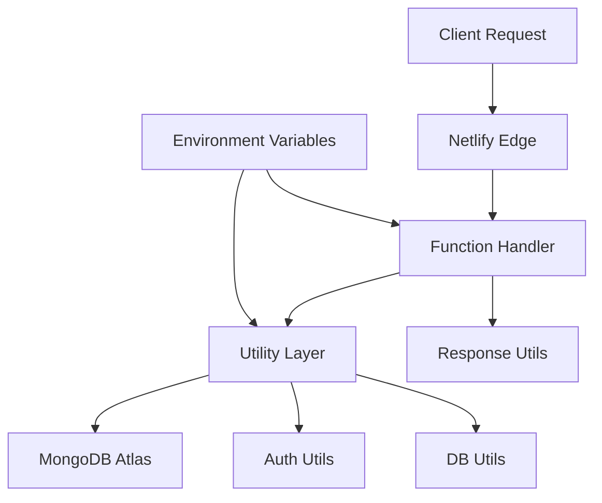

# Design Document: Netlify Functions Fix

## Overview

This design addresses the 500 Internal Server Errors occurring with Netlify functions by fixing environment variable configuration, MongoDB connection issues, dependency management, and error handling. The solution focuses on proper serverless deployment practices and robust error handling.

## Architecture

The Netlify functions architecture consists of:

1. **Function Layer**: Individual serverless functions handling specific API endpoints
2. **Utility Layer**: Shared utilities for database connection, authentication, and response formatting
3. **Model Layer**: Mongoose models for data structure definitions
4. **Environment Layer**: Configuration management for secrets and connection strings



## Components and Interfaces

### Environment Configuration Manager
- **Purpose**: Validate and manage environment variables
- **Interface**: 
  - `validateEnvironment()`: Check required environment variables
  - `getConfig()`: Return configuration object with validation
- **Dependencies**: None

### Enhanced Database Connection
- **Purpose**: Robust MongoDB Atlas connection with proper error handling
- **Interface**:
  - `connectDB()`: Establish connection with retry logic
  - `validateConnection()`: Test connection health
  - `getConnectionStatus()`: Return current connection state
- **Dependencies**: mongoose, environment variables

### Function Wrapper
- **Purpose**: Standardize function structure with error handling and CORS
- **Interface**:
  - `wrapFunction(handler)`: Wrap function with standard middleware
  - `handleCORS()`: Process CORS preflight requests
  - `validateRequest()`: Basic request validation
- **Dependencies**: response utils

### Dependency Validator
- **Purpose**: Ensure all required packages are available
- **Interface**:
  - `validateDependencies()`: Check package availability
  - `getPackageInfo()`: Return package version information
- **Dependencies**: Built-in modules

## Data Models

### Environment Configuration
```javascript
{
  mongodbUri: string,          // MongoDB Atlas connection string
  jwtSecret: string,           // JWT signing secret
  nodeEnv: string,            // Environment (development/production)
  frontendUrl: string         // CORS origin URL
}
```

### Connection Status
```javascript
{
  isConnected: boolean,        // Current connection state
  lastConnected: timestamp,    // Last successful connection
  connectionString: string,    // Sanitized connection info
  error: string | null        // Last error message
}
```

### Function Response
```javascript
{
  success: boolean,           // Operation success status
  message: string,           // Human-readable message
  data: object | null,       // Response data
  error: string | null,      // Error details (development only)
  timestamp: string          // Response timestamp
}
```

## Correctness Properties

*A property is a characteristic or behavior that should hold true across all valid executions of a system-essentially, a formal statement about what the system should do. Properties serve as the bridge between human-readable specifications and machine-verifiable correctness guarantees.*

### Converting EARS to Properties

Based on the prework analysis, I'll convert the testable acceptance criteria into correctness properties:

**Property 1: Environment Variable Validation**
*For any* Netlify function deployment, all required environment variables (MONGODB_URI, JWT_SECRET) should be present and valid before function execution begins
**Validates: Requirements 1.1, 1.2, 1.4**

**Property 2: Environment Error Messaging**
*For any* missing or invalid environment variable, the system should return a descriptive error message that identifies the specific missing variable
**Validates: Requirements 1.3**

**Property 3: Database Connection Establishment**
*For any* valid MongoDB URI, the connection should be successfully established and cached for reuse across multiple requests
**Validates: Requirements 2.1, 2.4**

**Property 4: Database Connection Error Handling**
*For any* database connection failure, the system should return an appropriate error message with sanitized connection details
**Validates: Requirements 2.2, 2.3**

**Property 5: Dependency Validation**
*For any* function deployment, all required npm packages should be available and importable at function startup
**Validates: Requirements 3.1, 3.4**

**Property 6: Dependency Error Handling**
*For any* missing or incompatible package, the system should return a clear error message identifying the specific dependency issue
**Validates: Requirements 3.2, 3.3**

**Property 7: Error Logging Consistency**
*For any* function error, detailed error information should be logged while maintaining consistent error response formats
**Validates: Requirements 4.1, 4.4**

**Property 8: CORS Handling**
*For any* OPTIONS preflight request, the system should return appropriate CORS headers without executing business logic
**Validates: Requirements 4.3**

**Property 9: Debug Information Exposure**
*For any* debug-enabled request, the system should return environment and configuration details without exposing sensitive information
**Validates: Requirements 4.2**

**Property 10: Authentication Flow Integrity**
*For any* authentication request (login/signup), the system should handle the complete flow correctly and return expected response formats
**Validates: Requirements 5.2, 5.4**

## Error Handling

### Environment Variable Errors
- Missing MONGODB_URI: Return 500 with message "Database configuration missing"
- Invalid MONGODB_URI format: Return 500 with message "Invalid database connection string"
- Missing JWT_SECRET: Return 500 with message "Authentication configuration missing"

### Database Connection Errors
- Connection timeout: Return 500 with message "Database connection timeout"
- Authentication failure: Return 500 with message "Database authentication failed"
- Network errors: Return 500 with message "Database connection failed"

### Dependency Errors
- Missing packages: Return 500 with message "Required dependency not found: {package}"
- Version conflicts: Return 500 with message "Package version incompatible with serverless environment"

### Request Errors
- Invalid JSON: Return 400 with message "Invalid JSON in request body"
- Missing required fields: Return 400 with message "Missing required field: {field}"
- Unauthorized access: Return 401 with message "Authentication required"

## Testing Strategy

### Dual Testing Approach
The testing strategy combines unit tests for specific scenarios and property-based tests for comprehensive validation:

**Unit Tests**:
- Test specific error conditions and edge cases
- Validate CORS preflight handling
- Test environment variable validation with known values
- Verify specific authentication flows

**Property-Based Tests**:
- Test environment validation across various configuration scenarios
- Validate database connection handling with different URI formats
- Test error response consistency across all function types
- Verify dependency validation across different package scenarios

**Property-Based Testing Configuration**:
- Use Jest with fast-check library for property-based testing
- Configure minimum 100 iterations per property test
- Tag each test with format: **Feature: netlify-functions-fix, Property {number}: {property_text}**
- Each correctness property implemented as a single property-based test

**Testing Environment**:
- Local testing with Netlify CLI to simulate serverless environment
- Mock MongoDB connections for isolated testing
- Environment variable injection for testing different configurations
- CORS testing with actual preflight requests